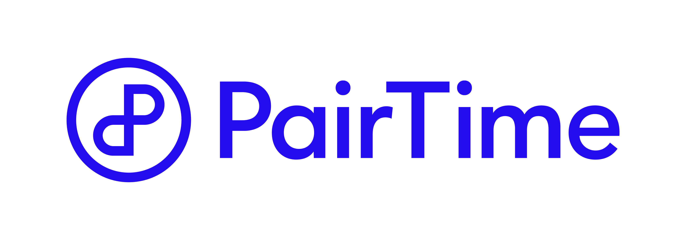

## Pulsar for startup

#### Pulsar Meetup 2021.12 

*** For text alignment check the following
*** https://github.com/hakimel/reveal.js/issues/1897
*** https://stackoverflow.com/questions/21019476/how-can-i-get-left-justified-paragraphs-in-reveal-js?utm_medium=organic&utm_source=google_rich_qa&utm_campaign=google_rich_qa

This is the title page.

--- &vertical

### About me

> - Data science & engineering since 2015
> - Independent consultant since 2019
> - 

  Building https://pairtime.com
  <figure></figure>

--- &vertical

### About PairTime Tech

> - Event sourced backend (Scala)
> - Server-side rendered frontend (Scala)
> - Deep learning models for recommendations (Python and Rust)

--- &vertical

### Event sourcing is about...

> - keeping full history of your domain events
> - software states being derived from the events
 (let's call anything that has a state an entity)

***

#### Benefit of event sourcing

> - You don't lose data
> - Time travel
> - Events are your data model

***

#### Requirements for storing events 

> - Low latency and high throughput for writing
> - Low latency and high throughput for state derivation
> - No limit on the volume of data
> - Support full history replay

--- &vertical

### Problems we had

> - We use Akka's Cassandra event store, which doesn't have unlimited scalability on data volume
> - We want to build/update the query side (as in CQRS) views in real time

***

### Why not kafka 

> - Each Kafka partition is bounded by a signle disk and can not be split
> - The Avro serializer (to use the schema registry) uses a binary format that is incompatible with Apache Avro.

---

# Thank you! 

